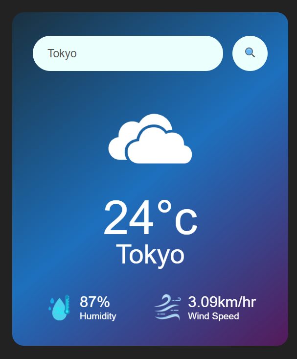
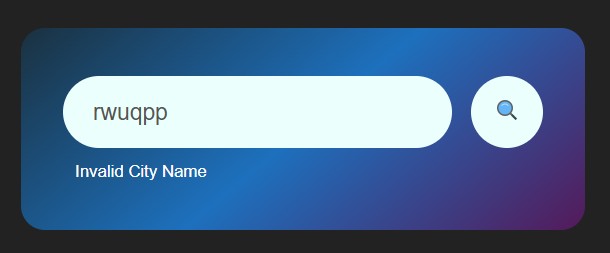

# 🌦️ Weather App

A simple and responsive weather application built using HTML, CSS and JavaScript.

This application allows users to search for a city and view its current weather information.

## 🚀 Features

- 🔍 Search weather by city name
- 🌡️ Display temperature
- 💧 Display humidity
- 💨 Display wind speed
- 🌤️ Display weather information with weather icons
- ❌ Shows an error message for an invalid city name
- 📱 Responsive design for smaller screens
- 🎨 Simple and clean user interface

## 🛠️ Technologies Used

- HTML5
- CSS3
- JavaScript
- OpenWeatherMap API

## 📸 Screenshots

### Weather App



### Invalid City Message



## 📂 Project Structure

```text
Weather-App/
│
├── images/
│   ├── cloud.png
│   ├── rain.png
│   ├── sun.png
│   ├── humidity.png
│   └── ...
│
├── index.html
├── style.css
├── script.js
└── README.md
```

## 🔧 How to Use

1. Open the Weather App.
2. Enter the name of a city in the search box.
3. Click the search button.
4. The weather information for the city will be displayed.
5. If the city name is invalid, an error message will be shown.

## ⚠️ Error Handling

The application displays an **"Invalid City Name"** message when the entered city cannot be found.

## 🌐 API

This project uses the **OpenWeatherMap API** to retrieve weather information.

## 👩‍💻 Author

**Arooj Kiran**

## 📄 License

This project is created for learning and educational purposes.
